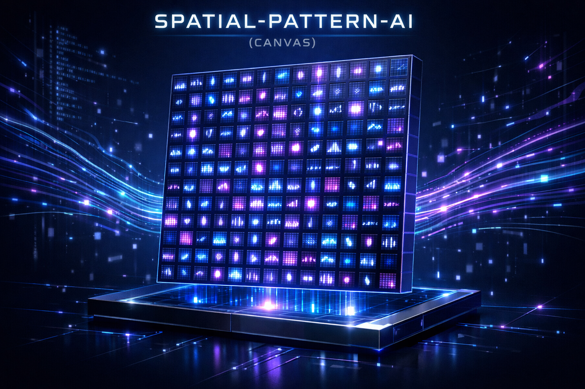

# IMG-CANVAS

**Dual-modality spatial pattern engine — text and image share one keyframe space.**

Text is stored as a 256×256 brightness grid per clause. Images are stored as a 64×64 CE grid of interpreted cells. Both are bound to the same `Keyframe` so one lookup covers both modalities.

Everything runs on **bounded-integer resume codes**: tiny state indices that reconstruct large values through precomputed lookup tables. No float, no softmax, no training loop — just store, match, re-expand.



---

## What you get

| Side | Input | Storage | Inference |
|---|---|---|---|
| **Text** | line-per-clause UTF-8 | 256×256 RGBA grid, keyframe+delta chain, EMA priors, topic-hash bucket | `ai_predict`, `ai_generate_next`, `ai_recluster` |
| **Image** | PNG/JPEG/BMP/TGA/PPM (any dim) | 64×64 CE grid of interpreted cells; 9 216-entry baked SoA delta tables | `img_pipeline_run` (seed → BFS expand → resolve), `img_delta_memory_learn_from_images` |
| **Bimodal** | text label + image | `Keyframe.ce_snapshot` pointer per KF, saved via `SPAI_TAG_CE_SNAPSHOT = 0x08` | text-side match returns the paired CE snapshot; CE match returns the paired text grid |

Each engine scores 0..1 independently; the caller combines them (`joint = α·text + β·ce`) without any mixed state-key space.

---

## Architecture

```
             ┌───────────────── text clause ─────────────┐
             │ "The Eiffel Tower was built in 1887."     │
             │                                           │
             ▼                                           ▼
         morpheme + word + byte layers              detect_data_type
         3-layer bitmap × weights (1/2/1)           PROSE / DIALOG / CODE / SHORT
             │                                           │
             ▼                                           ▼
         256×256 RGBA grid   ◄────── RGB EMA prior ──────┘
             │                      (per-position stabiliser)
             ▼
         Keyframe (id, topic_hash, seq_in_topic, data_kind, ce_snapshot)
             │                                           ▲
             │                                           │
             │   ┌────────── image (any dim RGB) ────────┘
             │   ▼
             │  SmallCanvas 256×256          ← R=intensity G=flow B=mood A=depth
             │  CE grid     64×64            ← R=core G=link B=delta A=priority
             │                                 + tone/role/dir/depth/delta_sign tags
             │       │
             │       ▼
             │  seed (top-K priority) → BFS expand (best delta via O(1) SoA lookup)
             │                       → resolve (outlier / explained / promoted)
             │                       → auto-feedback (success_count ++ on surviving cells)
             │
             ▼
         ai_save / ai_load  →  .spai (SPAI v8)    .imem (IMEM v1)
```

Two engines, one container. No mixed StateKey space — the Keyframe id is the only shared surface.

---

## Quick start

```bash
cd spatial_ai

make           # build engine
make test      # 21 suites (12 text + 9 image/bimodal)
make demo      # build demo_pipeline CLI
make train     # build image training CLI
make chat      # build interactive chat REPL
make stream    # build stream_train for text corpora
```

### Run a bimodal training pass on the bundled images

```bash
./build/train --model out.spai --memory out.imem data/train_manifest.tsv
```

6 cross-pair rows over `main_hero.png`, `visualization_1.png`, `visualization_2.png`:

```
  [1] hero to visualization 1             +3 734 deltas  kf=0  ce=yes
  [2] visualization 1 to hero             +3 734 deltas  kf=1  ce=yes
  ...
=== train summary ===
  deltas added:     22 790
  weight buckets:   46 rare / 46 second / 22 698 baseline
  keyframes:        6
  ce snapshots:     6
```

The rarity sieve caught 46 first-of-bucket patterns + 46 second-of-bucket; everything else collapsed to baseline weight.

### Visualise the CE state

```bash
./build/demo_pipeline --adapt assets/main_hero.png out/hero
```

Writes `out/hero_plain.{png,ppm}` (CE-rendered image) and `out/hero_masked.{png,ppm}` (same + resolve-mask tint: cyan = absorbed, red = unresolved).

### Stream-train on a text corpus

```bash
./build/stream_train --input data/wiki5k.txt --max 5000 \
                     --save build/models/wiki5k.spai --verify
```

Writes checkpoints every 5 000 clauses, auto-calibrates the delta/keyframe threshold if `--target-delta R` is set, re-clusters after training.

### Interactive chat REPL

```bash
./build/chat --load build/models/wiki5k.spai --session build/chat.session
> /ret how are you
> /topk 5 eiffel tower
> /gen tell me about the tower
> /img a sunset over paris    # routes to $IMG_CANVAS_BIN if set
> :save build/chat.session
```

`:history / :reset / :ctx N` manage the turn buffer (ring, max 8). Sessions round-trip to disk via `:save <path>` and `:load <path>` or the `--session` flag.

---

## Tools

| Tool | What it does | Source |
|---|---|---|
| `chat`          | REPL with turn-context + query router (`/gen /ret /img /topk`) + session persistence | `tools/chat.c` |
| `stream_train`  | Line-by-line text ingest with checkpointing + auto-threshold calibration + optional training-event log | `tools/stream_train.c` |
| `train`         | Batch image training from a TSV manifest. Emits `.spai` + `.imem`, supports `--resume` | `tools/train.c` |
| `demo_pipeline` | One-shot image → CE → render. `--adapt` for per-image tier thresholds; PNG + PPM outputs | `tools/demo_pipeline.c` |
| `gen_delta_tables` | Offline generator for the baked SoA CE delta tables (runs `make gen-tables`) | `tools/gen_delta_tables.c` |
| `bench_perplexity`, `bench_word_predict`, `bench_qa`, `bench_stsb` | Text-engine benchmark suites | `tests/bench_*.c` |

---

## Training data formats

**Text (line-per-clause)** — UTF-8, one clause per line. The engine auto-classifies each line into PROSE / DIALOG / CODE / SHORT based on length and special-char ratio, and per-type thresholds drive the keyframe/delta decision.

**Image** — any format stb_image reads (PNG, JPEG, BMP, TGA) or binary P6 PPM. Any dimension ≥ 1×1 is accepted; the pipeline block-averages to 256×256. RGB only — alpha is dropped.

**Bimodal TSV manifest** — one row per learning example:

```
<text_label>\t<before_image>\t<after_image>
hero to visualization 1	assets/main_hero.png	assets/visualization_1.png
```

Comments start with `#`. Blank lines skipped.

**Model files:**
- `.spai` — SpatialAI (text keyframes + deltas + weights + EMA tables + canvas pool + CE snapshots). Append-only save via `ai_save_incremental`.
- `.imem` — DeltaMemory (image-side symbolic rules, 40 bytes per unit, little-endian explicit fields).

---

## Project layout

```
IMG-CANVAS/
├── assets/                        hero / demo images used by this README
├── docs/
│   └── benchmarks/
│       └── v2_text_engine/        wiki5k + wiki20k benchmark reports
├── spatial_ai/
│   ├── SPEC.md                    text engine spec v3
│   ├── SPEC-CE.md                 image CE engine spec v1
│   ├── SPEC-ENGINE.md             engine-level optimisation notes
│   ├── TODO_recluster.md          recluster / calibration roadmap
│   ├── README.md                  text-engine local README (KR)
│   ├── Makefile                   unified build + tests + tools
│   ├── include/
│   │   ├── spatial_*.h            text engine (12 headers)
│   │   ├── spatial_bimodal.h      text ↔ image binding layer
│   │   └── img_*.h                image CE engine (9 headers)
│   ├── src/
│   │   ├── spatial_*.c            text engine
│   │   ├── spatial_bimodal.c      bimodal bind / get / release
│   │   ├── img_*.c                image CE engine
│   │   └── img_delta_tables_data.c  AUTO-GENERATED baked tables
│   ├── tests/                     21 unit suites (make test)
│   ├── tools/                     chat / stream_train / train / demo_pipeline / gen_delta_tables
│   ├── third_party/               stb_image + stb_image_write (public domain)
│   └── data/                      sample corpora + training manifests
├── README.md                      this file
└── README_KO.md                   Korean mirror
```

---

## File formats

**SPAI (text side + bimodal):** `magic[4]="SPAI" | version=u32 | kf_count=u32 | df_count=u32 | reserved[3]`, followed by a tagged record stream. Tags in use:

| Tag | Meaning |
|---|---|
| `0x01` KEYFRAME      | `id, label, text_byte_count, topic_hash, seq_in_topic, data_kind, grid.ARGB` |
| `0x02` DELTA         | sparse (index, dA, dR, dG, dB) entries against parent |
| `0x03` WEIGHTS       | per-channel adaptive weights (4 × float) |
| `0x04` CANVAS        | full 2048×1024 subtitle canvas snapshot |
| `0x05` SUBTITLE      | subtitle track |
| `0x06` EMA           | RGB EMA prior (4 × GRID_TOTAL × float) |
| `0x07` CANVAS_DELTA  | P-frame canvas (sparse A/R/G/B diff vs parent) |
| `0x08` CE_SNAPSHOT   | **bimodal: image-side CE grid bound to a keyframe** |

Trailing records are forward-compatible — older readers stop cleanly on unknown tags.

**IMEM (image-side delta memory):** `magic[4]="IMEM" | version=u32 | count=u32 | reserved=u32`, followed by `count` × 40-byte unit records. Fields packed explicitly (little-endian); layout independent of struct padding.

---

## Testing

```bash
cd spatial_ai && make test
```

| Group | Suites | Tests |
|---|---|---|
| **Text engine** | grid, morpheme, layers, match, keyframe, context, integration, io, cascade, canvas, adaptive, subtitle | 12 |
| **Image CE**    | img_ce, img_delta_memory, img_set16, img_render, img_pipeline, img_tier_table, img_delta_learn, img_ce_diff | 8 |
| **Bimodal**     | test_bimodal | 1 |
| **Total**       |              | 21 |

All suites green on every commit. The `img_delta_memory` suite alone covers 22 test cases including StateKey packing, Laplace scoring, weighted-rarity inserts, save/load round-trip, and bad-magic rejection.

---

## Benchmarks

- Text: `docs/benchmarks/v2_text_engine/` — reference wiki5k and wiki20k runs with matching / self-recall / word-prediction / byte-perplexity / generation numbers under the v2 engine (commit `4c4e108`).
- Image: `./build/train` run on the bundled manifest reproduces `+22 790 deltas / 6 kf / 6 ce snapshots / 46+46 rare-bucket hits` (see Quick start).

---

## Related docs

- [`spatial_ai/SPEC.md`](spatial_ai/SPEC.md) — text engine full specification
- [`spatial_ai/SPEC-CE.md`](spatial_ai/SPEC-CE.md) — image CE engine specification v1
- [`spatial_ai/SPEC-ENGINE.md`](spatial_ai/SPEC-ENGINE.md) — performance / layout notes
- [`spatial_ai/TODO_recluster.md`](spatial_ai/TODO_recluster.md) — recluster & calibration roadmap
- [`README_KO.md`](README_KO.md) — Korean summary

---

## License

See [LICENSE](LICENSE).
