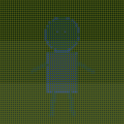
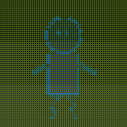
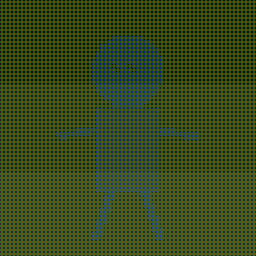
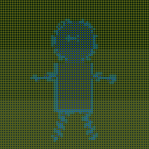

# IMG-CANVAS (한국어 요약)

**텍스트와 이미지가 같은 키프레임 공간을 공유하는 이중 모달 공간-패턴 엔진.**

자세한 내용은 [`README.md`](README.md) 참조. 여기는 한국어 요약.

---

## 무엇을 하나

| 모달 | 입력 | 저장 | 추론 |
|---|---|---|---|
| **텍스트** | UTF-8 한 줄 = 한 절 | 256×256 RGBA 격자, 키프레임+델타, EMA 사전, topic-hash 버킷 | `ai_predict`, `ai_generate_next`, `ai_recluster` |
| **이미지** | PNG / JPEG / BMP / TGA / PPM | 64×64 CE 격자, 9 216엔트리 베이크된 SoA delta 테이블 | `img_pipeline_run` (seed → BFS 확장 → resolve) |
| **양모달** | 텍스트 label + 이미지 | `Keyframe.ce_snapshot` 포인터, `SPAI_TAG_CE_SNAPSHOT=0x08` | 텍스트 쪽 매칭이 짝지어진 CE 스냅샷 반환 (역도 동일) |

두 엔진이 각자 0..1 점수를 내고 호출자가 `joint = α·text + β·ce`로 합산 — 내부적으로 섞인 state-key 없음.

---

## 빠른 실행

```bash
cd spatial_ai

make           # 엔진 빌드
make test      # 21개 suite (텍스트 12 + 이미지/양모달 9)
make demo      # 이미지 파이프라인 시각화 CLI
make train     # 이미지 배치 학습 CLI
make chat      # 대화형 REPL
make stream    # 텍스트 스트리밍 학습기
```

### 번들 이미지로 양모달 학습 한 번 돌리기

```bash
./build/train --model out.spai --memory out.imem data/train_manifest.tsv
```

→ 6쌍 × 평균 3 800 deltas ≈ 22 790 deltas / 6 keyframes / 6 CE snapshots.
Rarity sieve: 첫 등장 46개(×4 가중), 두 번째 등장 46개(×2), 나머지 22 698개는 baseline.

### CE 상태 시각화

```bash
./build/demo_pipeline --adapt assets/main_hero.png out/hero
```

`out/hero_plain.{png,ppm}`, `out/hero_masked.{png,ppm}` 출력. 마스크 틴트: cyan=흡수됨, red=미해결 outlier.

### 텍스트 스트리밍 학습

```bash
./build/stream_train --input data/wiki5k.txt --max 5000 \
                     --save build/models/wiki5k.spai --verify
```

5 000 절마다 체크포인트 / `--target-delta R`로 자동 임계값 캘리브 / 학습 후 재클러스터링.

### 대화형 REPL

```bash
./build/chat --load build/models/wiki5k.spai --session build/chat.session
> /ret how are you          # 검색
> /topk 5 eiffel tower      # 상위 K
> /gen tell me about it     # 생성
> /img sunset over paris    # 이미지 (IMG_CANVAS_BIN 환경변수로 외부 바이너리 연결)
> :history / :reset / :ctx 5 / :save <path> / :load <path>
```

턴 컨텍스트 링버퍼(최대 8) + 쿼리 라우터 + 세션 디스크 왕복.

---

## 학습 데이터 형식

- **텍스트**: 한 줄 한 절. PROSE / DIALOG / CODE / SHORT 자동 분류.
- **이미지**: stb_image가 읽는 포맷 또는 P6 PPM. 아무 크기 OK (256×256으로 블록 평균 다운샘플).
- **양모달 TSV**: `<label>\t<before.png>\t<after.png>` 행 단위.

---

## 캐릭터 10장 학습 데모

간단 재현 데모 — 이미지 파이프라인 + delta memory + rarity sieve + CE snapshot 바인딩 전체를 한 번에 돌림.

```bash
cd spatial_ai
./build/train --model build/char_trained/characters.spai \
              --memory build/char_trained/characters.imem \
              data/characters_manifest.tsv
```

**입력**: `assets/characters/`에 10장 (ruby, azure, moss, amber, slate, rose, noir, mint, sand, violet). 각각 동그란 머리 + 팔다리 스틱피겨, 색·포즈가 달라 CE 파이프라인이 서로 다른 tone/role/depth 버킷으로 분류.

**매니페스트**: 링 구조로 연쇄 (`ruby → azure → … → violet → ruby`, 10행).

**결과:**

| 지표 | 값 |
|---|---|
| 매니페스트 행 | 10 / 10 |
| 추가된 delta 수 | **7 633** |
| keyframes | 10 |
| CE snapshots | 10 |
| 가중치 버킷 | baseline 7 607 · 2~4× 13 · ≥4× rare 13 |
| `.spai` 크기 | ~4.5 MB (텍스트 격자 10 × ~328 KB + CE 스냅샷 + trailing record) |
| `.imem` 크기 | ~299 KB (7 633 delta × 40 B + 16 B 헤더) |

첫 등장 L2 버킷 13개가 rarity sieve에 잡혔고, 두 번째 링 반복에서 13개 더 적중. 나머지 7 607개는 baseline으로 공유 — **새 캐릭터 대부분이 이미 학습한 영역을 재사용한다는 뜻**.

**샘플 CE 렌더** (via `./build/demo_pipeline --adapt`):

| 원본 | Plain CE | Masked overlay |
|---|---|---|
| `char_01_ruby.png` |  |  |
| `char_07_noir.png` |  |  |

실루엣·몸통 구조가 64×64 CE 압축에서도 살아남음. masked 버전의 cyan은 resolve가 흡수한 outlier, red는 미해결(promoted) 셀.

`--resume`로 이어 학습: 2회차는 units 15 266 / keyframes 20으로 두 배. rarity 카운트는 그대로 — sieve가 2회차엔 모든 패턴을 "이미 본 것"으로 인식.

---

## 저장 포맷

- `.spai` — SpatialAI 전체 상태 (텍스트 키프레임 + 델타 + 가중치 + EMA + 캔버스 풀 + CE 스냅샷). `ai_save_incremental` 지원.
- `.imem` — DeltaMemory (이미지 쪽 심볼릭 규칙, 유닛당 40바이트 little-endian).

**SPAI 태그**: `0x01`~`0x07`는 v2 텍스트 엔진, **`0x08 CE_SNAPSHOT`이 양모달 이미지 측**. trailing record라 구 버전 리더는 unknown tag에서 깔끔히 멈춤.

---

## 디렉토리

```
IMG-CANVAS/
├── assets/                        README용 이미지
├── docs/benchmarks/v2_text_engine/  wiki5k / wiki20k 벤치 결과
├── spatial_ai/
│   ├── SPEC*.md TODO*.md          엔진 스펙 문서
│   ├── include/ src/ tests/       엔진 + 테스트
│   ├── tools/                     chat / stream_train / train / demo_pipeline / gen_delta_tables
│   ├── third_party/               stb_image (public domain)
│   └── data/                      샘플 코퍼스 + 매니페스트
├── README.md                      영문 메인
└── README_KO.md                   이 파일
```

---

## 참고 문서

- [`spatial_ai/SPEC.md`](spatial_ai/SPEC.md) — 텍스트 엔진 전체 명세
- [`spatial_ai/SPEC-CE.md`](spatial_ai/SPEC-CE.md) — 이미지 CE 엔진 명세 v1
- [`spatial_ai/SPEC-ENGINE.md`](spatial_ai/SPEC-ENGINE.md) — 성능 / 레이아웃 노트
- [`spatial_ai/TODO_recluster.md`](spatial_ai/TODO_recluster.md) — 재클러스터 / 캘리브 로드맵
- [`README.md`](README.md) — 전체 영문 README
